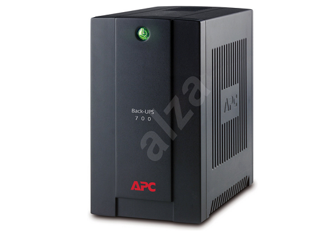

# Homework Two

Navrhnúť IoT systém pre snímanie teploty v mraziacich boxoch, s pripojením na internet a so záložným zdrojom.

## Hardware

Kľúčovými prvkami môjho návrhu by boli nasledovné komponenty:

1. [ArduinoNano](https://www.alza.sk//arduino-nano-v3-0-d569054.htm?kampan=adw1_komponenty_pla_all_komponenty_ostatne-komponenty_c_9062580__ARD201a&gclid=Cj0KCQjwp86EBhD7ARIsAFkgakiedr1z6fPFfGzb5HmPeEfbvSeyEKf5FKff7RoFTQyBQrz4BOHkjIwaAqZcEALw_wcB)

Úloha: Spracovanie údajov zo snímačov a ich odoslanie.

  

2. [Platinový senzor Tesla Pt1K](https://asset.conrad.com/media10/add/160267/c1/-/en/001511537DS01/datasheet-1511537-tesla-pt1k-class-13b-ptc-platinovy-teplotny-senzor-200-do-400-c-1000-3850-ppmk.pdf)

Úloha: Snínamnie teploty.

  

3. [ESP8266 Wifi module](https://www.laskarduino.cz/ai-thinker-esp-01s-esp8266-wifi-modul/?currency=eur&gclid=Cj0KCQjwp86EBhD7ARIsAFkgakg3YOmTASXNXyfNyC6jDy_9o-F4IJPiZdrWw57Onl1gpS4XfUrdWIcaApOnEALw_wcB)

Úloha: Hardware zabezpečujúci komunikáciu prostredníctvom wifi medzi mikroprocesorom a serverom, do ktorého budú údaje logované.

  

4. [Záložný zdroj](https://www.alza.sk/apc-back-ups-bx-700-eurozasuvka-d2356824.htm)

Úloha: Udržanie chodu zariadenia v prípade výpadku el. prúdu.

  

## Software

Pre účely zdieľania údajov zo serverom, by som na základe [mojich zručností](https://www.youtube.com/watch?v=R9vRfO1qSFA) použil [Johny-Five](http://johnny-five.io/) javascript knižnicu. Tá umožňuje jednoduchú komunikáciu medzi mikroprocesorom a NodeJs serverovou aplikáciou (napr. ExpressJs). Získané údaje by tak mohli byť zaslané z arduina na lokálnu NodeJs serverovú aplikáciu a z nej uložené do databázy (napr. MongoDB), z ktorej údaje by mohli byť získané iným, hierarchicky vyšším systémom/serverom.
